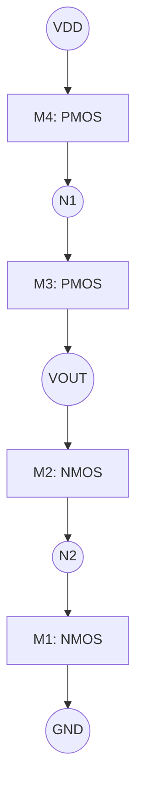
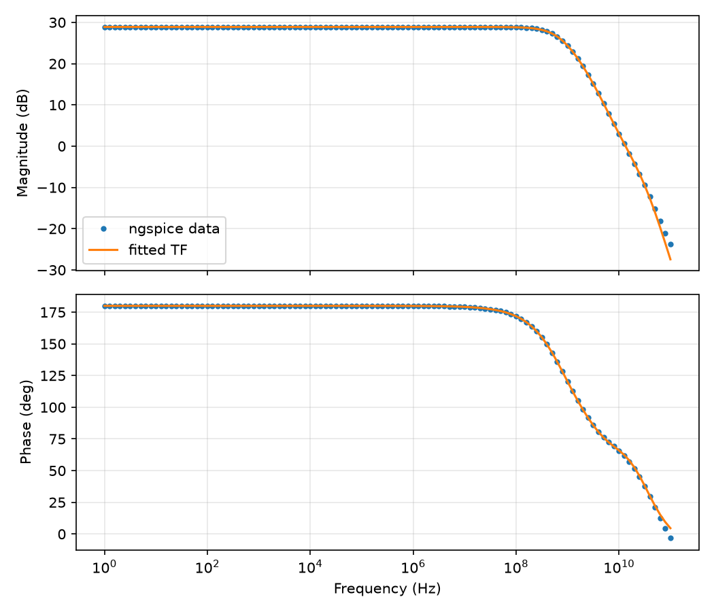

# Telescopic Cascode Amplifier

An educational SkyWater 130 nm / Ngspice study of a four-transistor telescopic cascode amplifier. The design explores biasing, device scaling, small-signal gain, output resistance, and the dominant output pole.

## Design target

| Requirement | Target |
| --- | ---: |
| Supply voltage | 1.6 V |
| Bias current | 2 mA |
| Minimum transistor $V_{DS}$ | 400 mV |
| Device model | `sky130_fd_pr__nfet_01v8`, `sky130_fd_pr__pfet_01v8` |

The design allocates approximately 400 mV across each device. As a first-order biasing rule, the overdrive voltage is chosen close to the required drain-source voltage:

$$V_{GS} - V_{TH} \approx V_{DS}$$

## Topology



The PMOS devices form the active load and the NMOS devices form the common-source/cascode stack. For this learning example, the bulk of M2 is connected to `N2` rather than to the usual PMOS bulk supply connection.

## Device characterization

The default devices were first simulated at approximately 400 mV drain-source voltage, then scaled to produce the 2 mA branch current.

| Device | Bias assumption | $V_{GS}$ | $g_m$ | $g_{ds}$ | $I_D$ |
| --- | --- | ---: | ---: | ---: | ---: |
| NMOS | $V_{TH} \approx 0.70$ V | 1.10 V | 2.061 mS | 0.301 mS | 0.556 mA |
| PMOS | $V_{TH} \approx -0.95$ V | -1.35 V | 0.371 mS | 0.049 mS | 0.090 mA |

The small-signal output resistance is $r_o = 1/g_{ds}$. The SPICE decks use multiplicity parameters to scale the characterized devices:

```spice
.param scale_n = '2m / 5.561820e-4'
.param scale_p = '2m / 9.045101e-5'
```

For the scaled devices, $I_D$ and $g_m$ increase approximately with the multiplier, while $r_o$ decreases approximately by the same factor.

## Hand analysis

For the cascoded branches, the approximate small-signal output resistances are

$$R_P \approx g_{m3}r_{o3}r_{o4} + r_{o3} + r_{o4}$$

$$R_N \approx g_{m2}r_{o1}r_{o2} + r_{o1} + r_{o2}$$

$$R_{out} \approx R_N \parallel R_P$$

The voltage gain is estimated from

$$A_v \approx -g_{m1}R_{out}$$

The first-order hand calculation predicts an output resistance of roughly 4.2 kΩ and a gain near 29 dB.

## Simulation results

### DC operating point

The operating-point simulation produces the expected 400 mV steps through the stack:

| Node | Simulated voltage |
| --- | ---: |
| `N1` | 1.200000 V |
| `N2` | 0.400000 V |
| `Vout` | 0.800001 V |

### AC response

- Low-frequency gain: approximately **27.84 dB**
- Output phase: approximately **180°**
- Extracted output -3 dB frequency: approximately **746 MHz**
- Hand-estimated dominant-pole frequency: approximately **2.23 GHz**

The difference between the hand estimate and the extracted pole is expected from the simplified capacitance and gain assumptions used in the first-order model.



## Running the simulations

These commands require Ngspice and the SkyWater PDK installed at `/usr/local/share/pdk`.

```bash
ngspice -b cascode.spice -o op.log
ngspice -b ac_cascode.spice -o ac.log
```

Useful project files:

- [`cascode.spice`](cascode.spice): DC operating-point analysis
- [`ac_cascode.spice`](ac_cascode.spice): AC gain and phase analysis
- [`ac_cascode.txt`](ac_cascode.txt): exported AC data
- [`Rout/rout.spice`](Rout/rout.spice): output-resistance analysis
- [`PolesZeros/main.py`](PolesZeros/main.py): pole/zero analysis
- [`PolesZeros/res.txt`](PolesZeros/res.txt): pole/zero results

## Notes

- The calculations are intended for learning and first-order intuition; all final values should be checked against the device-level simulation.
- The AC testbench applies `AC 1` at the input, so the output magnitude directly represents the voltage gain.
- The NMOS bulk connection for M2 is intentionally non-standard and is included to study body-effect behavior.